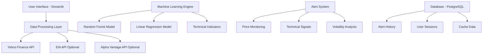

# 🛢️ Energy Intelligence Hub

> A comprehensive real-time energy market intelligence platform powered by machine learning and modern web technologies.

[](https://www.python.org/downloads/)
[](https://streamlit.io/)
[](https://opensource.org/licenses/MIT)
[](https://www.docker.com/)

## 🚀 Overview

The Energy Intelligence Hub is a sophisticated web application that provides real-time energy market intelligence, AI-powered price forecasting, and comprehensive technical analysis. Built for energy professionals, traders, and analysts.

### 🎯 Key Features

- **📊 Real-Time Dashboard**: Live energy commodity prices (WTI, Brent, Natural Gas)
- **🤖 AI-Powered Forecasting**: Machine learning models for price prediction
- **📈 Technical Analysis**: RSI, Moving Averages, Bollinger Bands
- **🔔 Smart Alerts**: Automated notifications for market movements
- **📉 Historical Analysis**: Deep-dive into price trends and volatility

## 🏗️ Architecture



## 🚀 Quick Start

### Prerequisites

- Python 3.11+
- Docker & Docker Compose (for containerized deployment)
- Git

### Option 1: Local Development

```bash
# Clone the repository
git clone https://github.com/zhenisduissekov/energy-intel-hub.git
cd energy-intel-hub

# Install dependencies
pip install -r requirements.txt

# Start the application
streamlit run app.py --server.port 5005
```

### Option 2: Docker Deployment (Recommended)

```bash
# Clone and start with Docker Compose
git clone https://github.com/zhenisduissekov/energy-intel-hub.git
cd energy-intel-hub

# Start all services (includes PostgreSQL database)
make up

# Or manually with docker-compose
docker-compose up -d
```

## 🏗️ Project Structure

```
energy-intel-hub/
├── app.py                 # Main Streamlit application
├── pages/                 # Streamlit multi-page application pages
│   ├── dashboard.py       # Main dashboard view
│   ├── forecasting.py     # Price forecasting page
│   └── analysis.py        # Technical analysis page
├── utils/                 # Utility functions and helpers
│   ├── data_loader.py     # Data loading and processing
│   ├── models.py          # ML models
│   └── technicals.py      # Technical analysis functions
├── data/                  # Data storage directory
├── attached_assets/       # Images and other static assets
├── requirements.txt       # Python dependencies
├── Dockerfile             # Docker configuration
└── docker-compose.yml     # Docker Compose configuration
```

## 🤝 Contributing

Contributions are welcome! Please read our [Contributing Guidelines](CONTRIBUTING.md) for details on our code of conduct and the process for submitting pull requests.

## 📄 License

This project is licensed under the MIT License - see the [LICENSE](LICENSE) file for details.

## 🙏 Acknowledgments

- Built with ❤️ using Streamlit and Python
- Data provided by Yahoo Finance and other financial data providers
- Icons by [Font Awesome](https://fontawesome.com/)